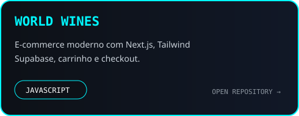
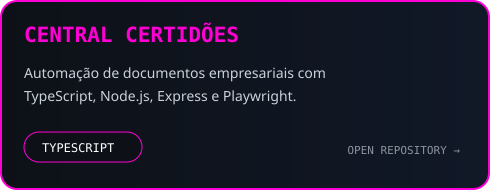
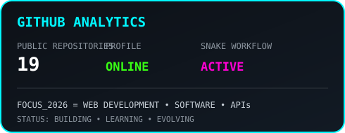
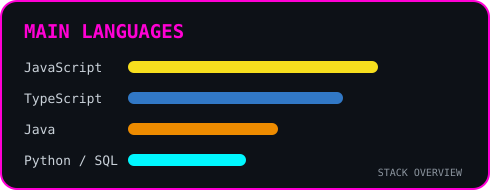
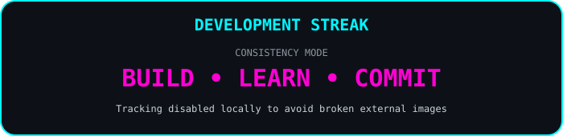
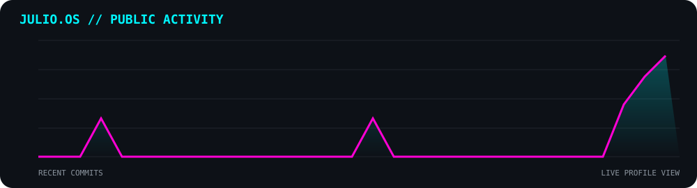
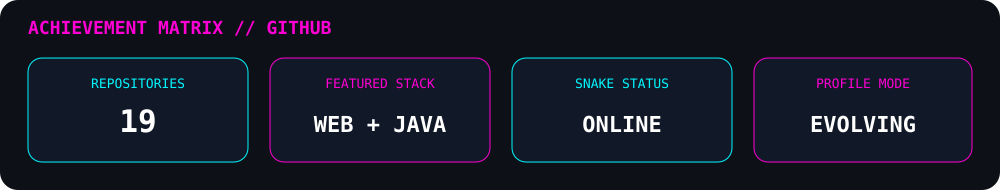

<div align="center">



<br/>


<br/>

<a href="https://github.com/Juliolimaal">
  
</a>
<a href="https://www.linkedin.com/in/juliocesardelimaalves">
  
</a>
<a href="https://www.instagram.com/juliocesar__18/">
  
</a>

</div>

---

## `01 // IDENTITY`

```txt
╭──────────────────────────────────────────────────────────────╮
│ USER        Julio Cesar                                     │
│ ROLE        Estudante de Sistemas para Internet             │
│ INSTITUTION IFPB                                            │
│ FOCUS       Web Development • Software • Technology         │
│ STATUS      Building • Learning • Evolving                  │
╰──────────────────────────────────────────────────────────────╯
```

Sou estudante de **Sistemas para Internet no IFPB** e desenvolvo projetos voltados para **desenvolvimento web, software, APIs, bancos de dados e programação orientada a objetos**.

Meu foco atual é transformar o que aprendo em projetos reais, evoluindo principalmente com **TypeScript, Angular, React, Next.js, Java, SQL e MongoDB**.

---

## `02 // TECH STACK`

<div align="center">

### `FRONT-END`


### `BACK-END / LANGUAGES`


### `DATABASE / CLOUD`


</div>

---

## `03 // TOOLKIT`

<div align="center">


</div>

---

## `04 // FEATURED PROJECTS`

<div align="center">

<a href="https://github.com/Juliolimaal/Project_PW2">
  
</a>
<a href="https://github.com/Juliolimaal/central-certidoes">
  
</a>

</div>

### `WORLD WINES // E-COMMERCE`

> Plataforma de e-commerce de vinhos criada com **Next.js, React, Tailwind CSS e Supabase**, com carrinho persistente, newsletter, páginas de produtos e integração de pagamento.

[](https://github.com/Juliolimaal/Project_PW2)
[](https://project-pw-2-alpha.vercel.app)

### `CENTRAL CERTIDÕES // AUTOMATION`

> Aplicativo local para Windows voltado à **centralização de consultas e documentos de regularidade empresarial**, usando **TypeScript, Node.js, Express e Playwright**.

[](https://github.com/Juliolimaal/central-certidoes)

---

## `05 // CURRENT MISSION`

```bash
julio@dev-machine:~$ ./mission.sh

[✓] TypeScript & JavaScript foundations
[✓] React & Next.js applications
[>] Angular ecosystem
[>] Java & Object-Oriented Programming
[>] SQL & NoSQL databases
[>] APIs, security & software architecture
[>] Stronger portfolio projects
[>] Professional opportunity in technology

SYSTEM_STATUS="EVOLVING"
NEXT_LEVEL="IN_PROGRESS"
```

---

## `06 // GITHUB ANALYTICS`

<div align="center">




<br/>



</div>

---

## `07 // ACTIVITY GRAPH`

<div align="center">



</div>

---

## `08 // TROPHIES`

<div align="center">



</div>

---

## `09 // CONTRIBUTION MATRIX`

<div align="center">

<p><code>CONTRIBUTION_PROTOCOL // ACTIVE</code></p>

<picture>
  <source media="(prefers-color-scheme: dark)" srcset="https://raw.githubusercontent.com/Juliolimaal/Juliolimaal/output/github-contribution-grid-snake-dark.svg">
  <source media="(prefers-color-scheme: light)" srcset="https://raw.githubusercontent.com/Juliolimaal/Juliolimaal/output/github-contribution-grid-snake.svg">
  
</picture>

</div>

---

## `10 // CONNECT`

<div align="center">

<a href="https://github.com/Juliolimaal">
  
</a>
<a href="https://www.linkedin.com/in/juliocesardelimaalves">
  
</a>
<a href="https://www.instagram.com/juliocesar__18/">
  
</a>

<br/><br/>

```txt
┌──────────────────────────────────────────────┐
│ JULIO.OS // SYSTEM ONLINE                   │
│ CODE • LEARN • BUILD • EVOLVE              │
└──────────────────────────────────────────────┘
```


</div>
